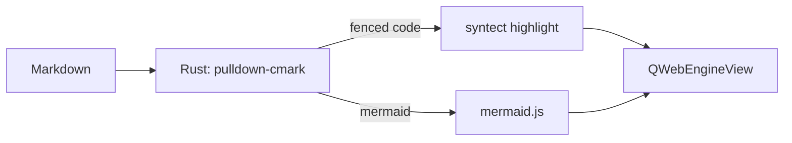
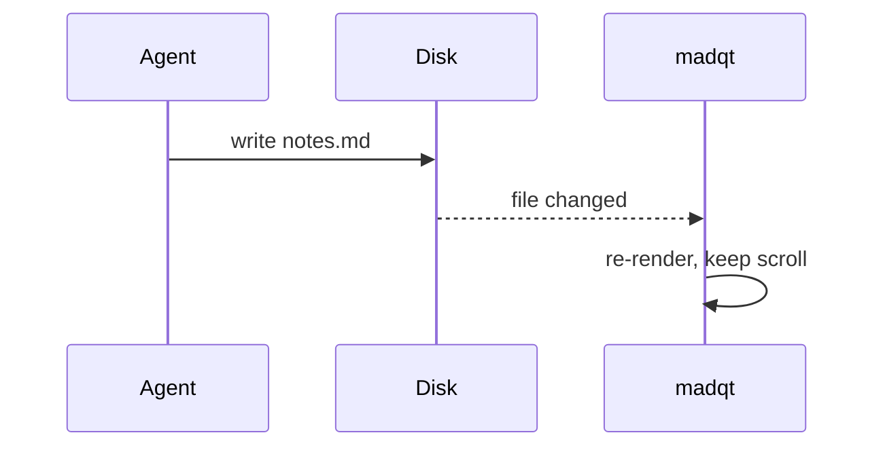

# madqt Feature Demo

A tour of everything the viewer renders. Open this file with
`./build/madqt demo/demo.md`.

## Text Styles

This paragraph mixes **bold**, *italic*, ***bold italic***, ~~strikethrough~~,
and inline `code`. Smart punctuation turns straight quotes into "curly" ones,
three dots into an ellipsis... and double dashes into an en dash -- like that.

## Links

- An external link: [kde.org](https://kde.org) — opens in your browser, never in-app
- An anchor link: [jump to the table](#tables) — scrolls within this document
  (headings need an explicit `{#id}`; ids aren't auto-generated from titles)
- A relative link: [the project README](../README.md) — opens with your default app
- Right-click any link to copy its address

## Images

A relative image, resolved from this document's directory:


## Lists

1. First ordered item
2. Second ordered item
   1. Nested ordered item
   2. Another one
3. Third ordered item

- Unordered item
- Another item
  - Nested bullet
  - One more

### Task Lists

- [x] Checkboxes sit on the marker gutter
- [x] Sized with the text
- [ ] This one is still open

### Definition Lists

Markdown
: A lightweight markup language, and the lingua franca of agents.

madqt
: A read-only Markdown viewer for Linux.
: Renders through Qt WebEngine.

## Blockquotes

> A blockquote shows muted text and border styling.
>
> > And they nest, too.

### Alerts

GitHub-style alerts render with a colored rule, icon, and title:

> [!NOTE]
> Useful information that users should know, even when skimming.

> [!TIP]
> Helpful advice for doing things better or more easily.

> [!IMPORTANT]
> Key information users need to know to achieve their goal.

> [!WARNING]
> Urgent info that needs immediate user attention to avoid problems.

> [!CAUTION]
> Advises about risks or negative outcomes of certain actions.

## Code

Inline `code` gets its own background. Fenced blocks with a language are
syntax-highlighted, with colors drawn from the active theme — comments,
keywords, strings, numbers, functions, and types each get their own hue:

```rust
/// Render markdown to HTML, highlighting fenced code blocks.
fn render(markdown: &str, opts: Options) -> String {
    let parser = Parser::new_ext(markdown, opts);
    let mut html = String::with_capacity(markdown.len() * 2);
    html::push_html(&mut html, parser);
    html
}
```

```cpp
#include <string_view>

// Tokens fall back to plain text when the language is unknown.
struct Theme {
    std::string_view name = "Sepia";
    int max_width = 720;
    bool built_in = true;
};
```

```python
import re

def slugify(title: str) -> str:
    """Lowercase, collapse non-alphanumerics to single dashes."""
    text = re.sub(r"[^a-z0-9]+", "-", title.lower())
    return text.strip("-") or "theme"
```

```javascript
// Live-reload: re-render and keep the reader in place.
const themes = ["light", "dark", "sepia"];
async function render(path) {
  const md = await fetch(path).then((r) => r.text());
  return themes.includes(active) ? highlight(md) : escape(md);
}
```

```bash
# Build the Rust crate and the Qt app.
cargo test --release --manifest-path rust/Cargo.toml
cmake --build build && ./build/madqt demo/demo.md
```

```json
{
  "name": "Midnight",
  "monospaceFontSize": 11,
  "syntaxKeywordColor": "#ff7b72",
  "builtIn": false
}
```

## Diagrams

Fenced ` ```mermaid ` blocks are rendered as diagrams by mermaid.js, themed to
match the active theme:





## Math

Inline math like $e^{i\pi} + 1 = 0$ flows with the text, while display math is
centered on its own line:

$$
\int_{-\infty}^{\infty} e^{-x^2}\,dx = \sqrt{\pi}
$$

## Tables {#tables}

| Feature        | Syntax            | Aligned right |
| -------------- | :---------------: | ------------: |
| Bold           | `**text**`        |             1 |
| Strikethrough  | `~~text~~`        |            42 |
| Task list      | `- [x]`           |           999 |

## Footnotes

Footnotes render as superscript references[^1] and collect their
definitions below[^2].

[^1]: Like this one.
[^2]: And this one, with `code` inside.

## Horizontal Rule

Text above the rule.

---

Text below the rule.
